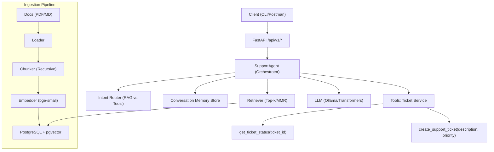

# AI Support Bot for Internal Product Queries

A lightweight agentic AI assistant that answers internal product-related queries from documentation and performs simple task-oriented actions like fetching ticket details or creating new support tickets via a tool interface.

## 🎯 Objective

Build a functional backend (FastAPI) that demonstrates:
- **Retrieval-Augmented Generation (RAG)** for document-based QA
- **Tool usage (multi-function agent)** for support tasks
- **RAG pipeline** with document ingestion, chunking, and semantic search
- **Deployment-readiness** with Docker + GPU-compatible setup

## 🏗️ Architecture

### High-Level System Diagram



### Core Components

- **FastAPI API Layer**: RESTful endpoints for chat, ingestion, and ticket management
- **Orchestrator (SupportAgent)**: Main agent that coordinates RAG vs Tool usage
- **Intent Router**: LLM-based classification to determine user intent
- **RAG Pipeline**: Document ingestion, chunking, embedding, and retrieval
- **Vector Store**: PostgreSQL + pgvector for semantic search
- **LLM Provider**: Ollama local models with GPU support
- **Tools**: Ticket service for support operations
- **Memory**: LangChain-based conversation history management

## 🚀 Quick Start

### Prerequisites

- Docker and Docker Compose
- NVIDIA Docker runtime (for GPU support)
- At least 8GB RAM (16GB recommended)
- 10GB+ free disk space

### 1. Clone and Setup

```bash
git clone <your-repo-url>
cd tantorinc
cp env.example .env
```

### 2. Start Services

**Linux/Mac:**
```bash
chmod +x start.sh
./start.sh
```

**Windows:**
```cmd
start.bat
```

### 3. Verify Deployment

```bash
# Check service status
docker-compose ps

# Health check
curl http://localhost:8000/health

# API documentation
open http://localhost:8000/docs
```

## 📚 Core Features

### 1. Document-based QA using RAG

- **Ingestion**: Support for PDF, Markdown, TXT, DOCX files
- **Chunking**: Intelligent text segmentation with configurable overlap
- **Embeddings**: BAAI/bge-small-en-v1.5 model for semantic search
- **Storage**: PostgreSQL + pgvector for efficient similarity search

**Example Usage:**
```bash
# Ingest a document
curl -X POST "http://localhost:8000/api/v1/ingest/file" \
  -F "file=@samples/sample_doc.pdf" \
  -F "chunk_size=1000" \
  -F "chunk_overlap=200"

# Ask questions
curl -X POST "http://localhost:8000/api/v1/chat" \
  -H "Content-Type: application/json" \
  -d '{"message": "What is the integration process?", "session_id": "test123"}'
```

### 2. Tool Integration (Agent Actions)

**Available Tools:**
- `get_ticket_status(ticket_id)` → Returns ticket status
- `create_support_ticket(description, priority)` → Creates new ticket
- `get_ticket_details(ticket_id)` → Returns comprehensive ticket info

**Example Usage:**
```bash
# Create a ticket
curl -X POST "http://localhost:8000/api/v1/chat" \
  -H "Content-Type: application/json" \
  -d '{"message": "Create a high priority ticket for login issues", "session_id": "test123"}'

# Check ticket status
curl -X POST "http://localhost:8000/api/v1/chat" \
  -H "Content-Type: application/json" \
  -d '{"message": "What is the status of ticket TKT-001?", "session_id": "test123"}'
```

### 3. Agent Orchestration

The system automatically:
- Classifies user intent using LLM-based routing
- Switches between RAG (document queries) and Tools (actions)
- Maintains conversation context across interactions
- Provides source citations for RAG responses

### 4. Memory Management

- **Session-based**: Each conversation maintains its own history
- **Context-aware**: Follow-up questions reference previous context
- **LangChain Integration**: Professional memory management with conversation buffers

## 🔧 Configuration

### Environment Variables

```bash
# Database
DATABASE_USER=trantor
DATABASE_PASSWORD=trantor_pass
DATABASE_NAME=trantor_db

# Embedding Model
EMBED_MODEL=BAAI/bge-small-en-v1.5

# LLM Configuration
LLM_MODEL=ollama:qwen2.5:7b-instruct
GPU_LAYERS=20

# API Settings
API_HOST=0.0.0.0
API_PORT=8000
```

### Database Schema

```sql
-- Documents table for RAG
CREATE TABLE ai.documents (
    id UUID PRIMARY KEY DEFAULT gen_random_uuid(),
    doc_id TEXT,
    chunk_id INT,
    content TEXT NOT NULL,
    metadata JSONB,
    embedding vector(384)
);

-- Tickets table for support tools
CREATE TABLE ai.tickets (
    id TEXT PRIMARY KEY,
    description TEXT NOT NULL,
    priority TEXT NOT NULL,
    status TEXT NOT NULL,
    created_at TIMESTAMPTZ NOT NULL DEFAULT now()
);
```

## 🐳 Deployment

### Local Development

```bash
# Install dependencies
pip install -r requirements.txt

# Set up environment
cp env.example .env
# Edit .env with your configuration

# Start PostgreSQL (if not using Docker)
docker run -d --name pgvector -e POSTGRES_PASSWORD=password -p 5432:5432 pgvector/pgvector:pg16

# Run the application
python -m uvicorn app.main:app --reload --host 0.0.0.0 --port 8000
```

### Docker Deployment

**CPU-only:**
```bash
docker-compose up -d
```

**GPU-enabled:**
```bash
# Ensure NVIDIA Docker runtime is available
docker-compose up -d
```

**Production:**
```bash
# Build optimized image
docker build --target production -t ai-support-bot:latest .

# Run with production settings
docker run -d \
  --name ai-support-bot \
  -p 8000:8000 \
  --env-file .env \
  ai-support-bot:latest
```

### GPU Instance Deployment (Colab/GCP/RunPod)

1. **Upload code** to your GPU instance
2. **Install Docker** and NVIDIA Docker runtime
3. **Set environment variables** for your instance
4. **Run startup script**:
   ```bash
   chmod +x start.sh
   ./start.sh
   ```

## 📊 API Endpoints

### Chat Interface
- `POST /api/v1/chat` - Main chat endpoint
- `GET /api/v1/chat/session/{session_id}/history` - Get conversation history
- `DELETE /api/v1/chat/session/{session_id}` - Clear session history

### Document Ingestion
- `POST /api/v1/ingest/file` - Upload and ingest document
- `POST /api/v1/ingest/path` - Ingest document from server path
- `GET /api/v1/ingest/status` - Get ingestion statistics

### Ticket Management
- `POST /api/v1/tickets` - Create new ticket
- `GET /api/v1/tickets/{ticket_id}` - Get ticket details

## 🧪 Testing

### Run Tests

```bash
# Run all tests
python -m pytest tests/

# Run specific test
python -m pytest tests/test_complete_system.py -v

# Run with coverage
python -m pytest tests/ --cov=app --cov-report=html
```

### Test Scenarios

1. **RAG Testing**: Document ingestion and question answering
2. **Tool Testing**: Ticket creation and status checking
3. **Integration Testing**: End-to-end chat flow
4. **Performance Testing**: Response time and memory usage

## 📈 Performance & Scaling

### Resource Requirements

- **CPU-only**: 16GB RAM, 4+ CPU cores
- **GPU-enabled**: 8GB+ VRAM, 16GB+ RAM
- **Database**: 4GB+ RAM for vector operations

### Optimization Tips

- Use quantized models (Q4) for faster inference
- Adjust chunk sizes based on document characteristics
- Tune vector index parameters for your dataset size
- Enable GPU layers for Ollama models

## 🔍 Troubleshooting

### Common Issues

1. **Ollama Connection Failed**
   ```bash
   # Check Ollama service
   docker-compose logs ollama
   
   # Verify model download
   docker-compose exec ollama ollama list
   ```

2. **Database Connection Issues**
   ```bash
   # Check database health
   docker-compose exec db pg_isready -U trantor
   
   # Verify schema
   docker-compose exec db psql -U trantor -d trantor_db -c "\dt ai.*"
   ```

3. **Memory Issues**
   ```bash
   # Reduce chunk size
   export CHUNK_SIZE=500
   
   # Limit GPU layers
   export GPU_LAYERS=10
   ```

### Debug Commands

```bash
# View all logs
docker-compose logs -f

# Check service status
docker-compose ps

# Access application shell
docker-compose exec app bash

# Monitor resource usage
docker stats
```

## 📝 Example Queries and Expected Outputs

### RAG Questions

**Input:** "What is API testing?"
**Expected Output:** 
```json
{
  "reply": "API testing is a type of software testing that validates the functionality, reliability, performance, and security of application programming interfaces (APIs)...",
  "sources": [
    {
      "content": "API testing involves testing APIs directly and as part of integration testing...",
      "score": 0.95
    }
  ],
  "tool_calls": []
}
```

### Tool Usage

**Input:** "Create a high priority ticket for security vulnerabilities"
**Expected Output:**
```json
{
  "reply": "Created ticket TKT-2024-001 with high priority",
  "sources": [],
  "tool_calls": [
    {
      "name": "create_support_ticket",
      "args": {"description": "security vulnerabilities", "priority": "high"},
      "result": "Created ticket TKT-2024-001 with high priority"
    }
  ]
}
```

### Follow-up Questions

**Input:** "What's the status of that ticket?"
**Expected Output:**
```json
{
  "reply": "Ticket TKT-2024-001 is currently Open with high priority",
  "sources": [],
  "tool_calls": [
    {
      "name": "get_ticket_status",
      "args": {"ticket_id": "TKT-2024-001"},
      "result": "Ticket TKT-2024-001 is Open (Priority: high)"
    }
  ]
}
```

## 🤝 Contributing

1. Fork the repository
2. Create a feature branch
3. Make your changes
4. Add tests for new functionality
5. Submit a pull request

## 📄 License

This project is confidential and proprietary to Trantor. Do not share without permission.

## 🆘 Support

For technical support or questions:
- Check the troubleshooting section above
- Review API documentation at `/docs`
- Check service logs: `docker-compose logs -f`
- Verify environment configuration

---

**Status**: ✅ Production Ready  
**Last Updated**: December 2024  
**Version**: 1.0.0
